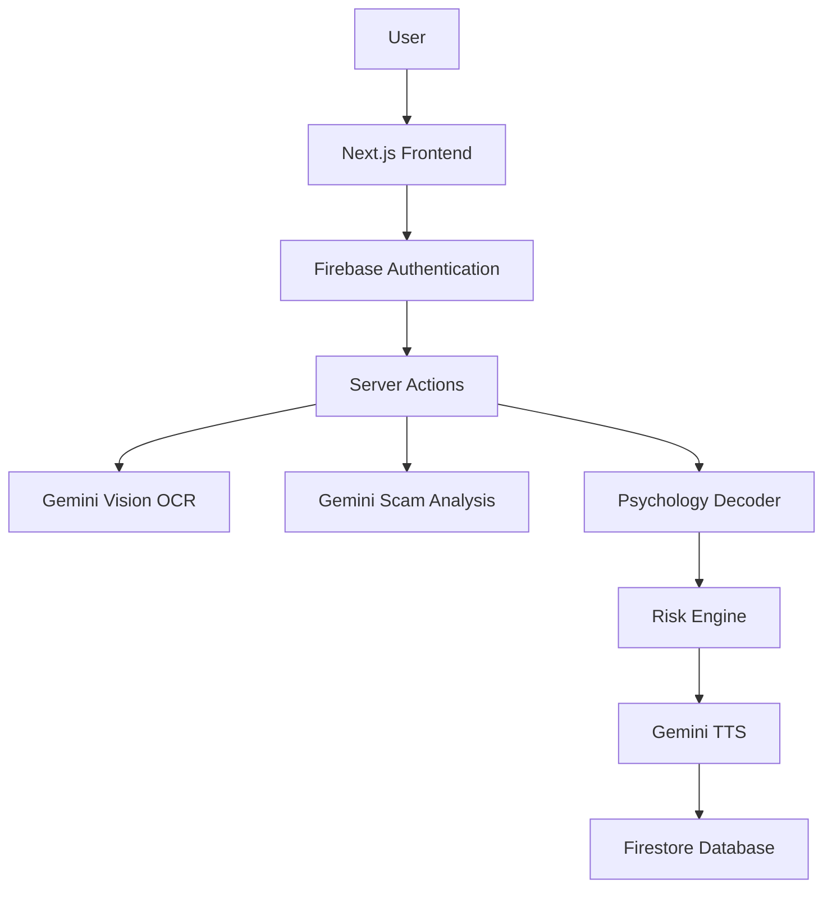
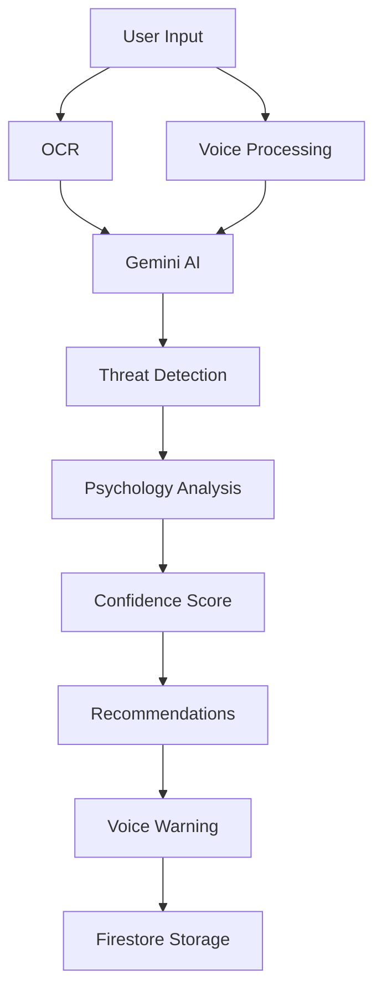

<div align="center">

# 🛡️ EchoShield AI

### **AI-Powered Scam Detection • Psychology Decoder • Explainable AI**

<p align="center">

</p>

<p align="center">


</p>

<p align="center">

<a href="#">

</a>

<a href="#">

</a>

<a href="#">

</a>

</p>

---

### ⭐ Detect Scams. Decode Manipulation. Defend People.

> **"Scammers don't hack systems anymore—they hack human psychology."**

</div>

---

# 📸 Preview

<p align="center">


</p>

---

# 🌍 Problem

Every day millions of people become victims of

- 🏦 Banking Phishing
- 💳 UPI Fraud
- 📦 Courier Scams
- 📞 Voice Phishing
- 🪪 Aadhaar & PAN Frauds
- 💼 Fake Job Offers
- ❤️ Romance Scams
- 🤖 AI Generated Social Engineering

Traditional scam detectors only answer

> **"Is this a scam?"**

EchoShield answers

> **"Why is this dangerous, how is it manipulating you, and how can you stay safe?"**

---

# 🚀 What is EchoShield AI?

EchoShield AI is an Explainable AI cybersecurity platform that detects digital scams from

- 📷 Screenshots
- 💬 Chats
- 📄 Documents
- 🎤 Voice Recordings

using **Google Gemini AI**, while explaining **why** a message is suspicious through psychological analysis and forensic evidence.

---

# ✨ Features

| 🧠 AI Detection | 📷 OCR | 🎤 Voice Warning | 🧬 Scam DNA |
|----------------|--------|-----------------|-------------|
| Scam Classification | Screenshot Analysis | Gemini TTS | Psychology Report |

| 📊 Dashboard | 🔐 Security | 📚 Scam Academy | 🎯 Explainable AI |
|--------------|------------|----------------|------------------|
| Safety Analytics | Firestore Rules | Learn Scam Awareness | Risk + Confidence |

---

# 🧠 Explainable AI

Unlike traditional AI detectors...

EchoShield explains every decision.

## 📊 Example Output

```text
Risk Score

96%

Confidence

98%

Evidence

✔ Suspicious URL

✔ OTP Request

✔ Fake Domain

✔ Authority Bias

✔ Urgency Pressure

✔ Emotional Manipulation
```

Because

> **High Risk ≠ High Confidence**

Every prediction includes transparent reasoning.

---

# 🧬 Scam DNA

```text
Fear             ██████████ 94%

Authority        █████████░ 88%

Urgency          ████████░░ 81%

Trust Abuse      ███████░░░ 73%

Greed            ████░░░░░░ 36%
```

EchoShield teaches users **how scammers manipulate emotions**, not just whether a message is malicious.

---

# 🇮🇳 India First Threat Intelligence

Specialized detection for

- ✅ UPI Fraud
- ✅ Aadhaar Scam
- ✅ PAN Scam
- ✅ Banking Phishing
- ✅ Courier Fraud
- ✅ Electricity Bill Scam
- ✅ Fake Government Messages
- ✅ Customs Scam
- ✅ KYC Fraud

---

# 🎤 AI Voice Warning

For high-risk threats, EchoShield automatically generates an audio warning using

> **Gemini 2.5 Flash Preview TTS**

allowing users to hear safety alerts instantly.

---

# 🏗 System Architecture



---

# ⚡ AI Analysis Pipeline



---

# 🔐 Security First

EchoShield follows a **Secure by Design** architecture.

## Security Principles

- 🛡 Zero Trust Inputs
- 🔒 Least Privilege
- 📚 Explainable AI
- 🧠 Prompt Injection Protection
- 🔍 Threat Modeling
- 🔐 Privacy by Design
- ⚙ Responsible Disclosure

---

# 🧪 Automated Testing

## Unit Tests

- Threat Analysis
- OCR Integration
- Voice Trigger Logic
- Input Sanitization

---

## Component Tests

- Risk Meter
- Scam Simulator
- Triage Center

---

## Security Tests

- Firestore Rules
- User Isolation
- Immutable Reports
- Prompt Injection
- OCR Injection
- Unicode Attacks
- Homoglyph Detection

---

# 📈 Test Results

| Test Suite | Status |
|------------|--------|
| Unit Tests | ✅ Passed |
| Component Tests | ✅ Passed |
| Firestore Security | ✅ Passed |
| Prompt Evaluation | ✅ Passed |
| Threat Modeling | ✅ Passed |
| Explainable AI Audit | ✅ Passed |

## 🎉 Overall Result

# ✅ **19 / 19 Automated Tests Passed**

---

# 🛠 Tech Stack

<p align="center">


</p>

| Category | Technology |
|----------|------------|
| Frontend | Next.js 15 |
| Backend | Server Actions |
| Authentication | Firebase Auth |
| Database | Firestore |
| AI | Gemini 2.0 Flash |
| OCR | Gemini Vision |
| Voice | Gemini 2.5 Flash Preview TTS |
| Validation | Zod |
| Animation | Framer Motion |
| Testing | Vitest + React Testing Library |

---

# 📂 Project Structure

```text
EchoShield/

├── src/
│   ├── ai/
│   ├── app/
│   ├── components/
│   ├── services/
│   ├── hooks/
│   ├── firebase/
│   ├── lib/
│   └── types/
│
├── firestore.rules
├── SECURITY.md
├── README.md
├── package.json
└── .env
```

---

# 🚀 Getting Started

## Clone Repository

```bash
git clone https://github.com/USERNAME/EchoShield.git
```

---

## Install Dependencies

```bash
npm install
```

---

## Start Development Server

```bash
npm run dev
```

---

## Run Genkit

```bash
npm run genkit:dev
```

---

## Run Tests

```bash
npx vitest run
```

---

## Build Project

```bash
npm run build
```

---

# 🌍 Future Scope

- 📱 Android App
- 🍎 iOS App
- 🌐 Browser Extension
- 📞 Live Call Scam Detection
- 🌎 Multi-language Support
- 🤝 Community Threat Intelligence
- 🚨 Emergency Contact Alerts
- 📡 Real-time Threat Feed

---

# 👨‍💻 Built With

❤️ Artificial Intelligence

🛡 Cybersecurity

📚 User Education

☁ Google Gemini AI

⚡ Firebase

🚀 Next.js

---

# ⭐ Why EchoShield?

Unlike traditional scam detectors,

EchoShield not only detects scams but also explains **why they work**, helping users become more resilient against future attacks.

---

<div align="center">

# ⭐ Star this Repository

If you found this project useful,

please consider giving it a ⭐

---

### 🛡 Detect • Decode • Defend

### **Making the Internet Safer, One Scan at a Time.**


</div>